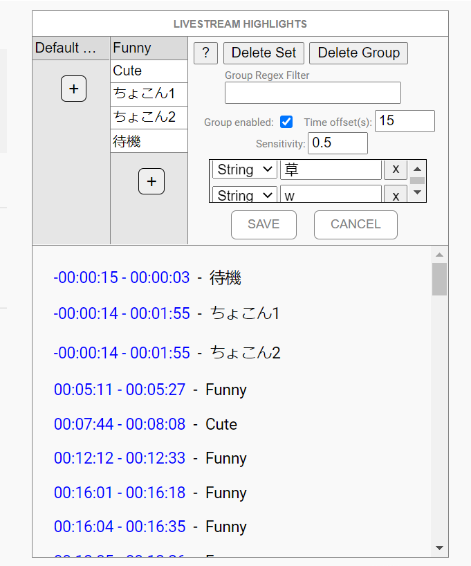

# Livestream Highlighter
A Google Chrome extension for analyzing and detecting trends in the live chats of YouTube livestreams. 

Note: Development of this project has ceased and this repository is purely an archive.

### Technologies used 
- Chrome Extensions API
- JavaScript & CSS3   

## Installation 
1. Clone this repository
2. Go to the "Extensions" page of Google Chrome
3. Turn on "Developer Mode" 
4. Click "Load unpacked" 
5. Select the cloned repository folder. 
6. Instructions for usage are in this repository's wiki page. 

## Example Image
With settings menu open:  
   

